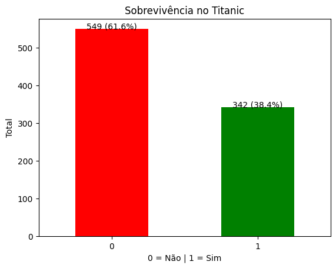
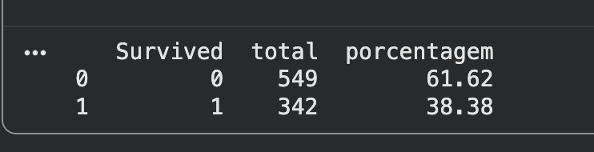
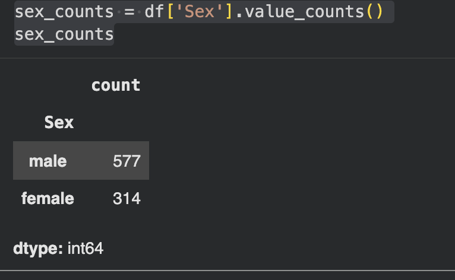

# Titanic_Python
New version of Titanic project but in Python


---

### Project Introduction 
By analyzing the Titanic dataset, I aim to identify the key factors that influenced passenger survival during the disaster.
The analysis focuses on variables such as gender, passenger class, age, and embarkation point to understand patterns and differences in survival rates.

The goal of this project is to apply SQL queries to extract meaningful insights and simulate real-world data analysis scenarios, supporting data-driven conclusions.

Data Quality Note: Missing values were identified in the Age and Cabin columns. These were considered during the analysis, with null values handled appropriately to avoid distortion in the results.

---


### How many passengers are in the Titanic dataset?

```
total_passageiros = df.shape[0]
print(total_passageiros)
```

The Titanic dataset contains 891 passengers.

---
### How many passengers survived and did not survive?

```
resultado = df.groupby('Survived').size().reset_index(name='total')

print(resultado)
```

In this dataset:

0 = did not survive
1 = survived

A total of 549 passengers did not survive, while 342 survived.
```
resultado = df['Survived'].value_counts().sort_index()

ax = resultado.plot(kind='bar', color=['red', 'green'])

total = resultado.sum()

for i, v in enumerate(resultado):
    porcentagem = (v / total) * 100
    ax.text(i, v, f'{v} ({porcentagem:.1f}%)', ha='center')

plt.title('Sobrevivência no Titanic')
plt.xlabel('0 = Não | 1 = Sim')
plt.ylabel('Total')

plt.xticks(rotation=0)

plt.show()
```

<table>
  <tr>
    <td align="center">
      <a href="#" title="Age">
        <br>
      </a>
    </td>
  </tr>
</table>


---

###  What is the percentage of survivors?

```
resultado = df.groupby('Survived').size().reset_index(name='total')

resultado['porcentagem'] = round(
    resultado['total'] * 100.0 / resultado['total'].sum(), 2
)

print(resultado)


```
38.38% survived
61.62% did not survive

<table>
  <tr>
    <td align="center">
      <a href="#" title="Age">
        <br>
      </a>
    </td>
  </tr>
</table>

----

### How many men and women were on the Titanic?
```
sex_counts = df['Sex'].value_counts()
sex_counts
```

<table>
  <tr>
    <td align="center">
      <a href="#" title="Age">
        <br>
      </a>
    </td>
  </tr>
</table>

---

### How many passengers embarked at each port?
```
select embarked, COUNT(*) 
from TitanicDataset
as total
group by embarked;
C 168 (France) Rich 
Q  77 (Newzeland) poor
S 644 (England) General
nULL 2

```
C (Cherbourg, France): 168 passengers
Q (Queenstown, Ireland): 77 passengers
S (Southampton, England): 644 passengers
NULL: 2 passengers (missing data)

---

### How many survived by gender?
```

SELECT 
    sex,
    survived,
    COUNT(*) AS total,
    ROUND(
        COUNT(*) * 100.0 / SUM(COUNT(*)) OVER(PARTITION BY sex),
        2
    ) AS percentage
FROM TitanicDataset
GROUP BY sex, survived
ORDER BY sex, survived;
```
Survival rates differ significantly by gender. 
Approximately 74% of females survived, while only about 19% of males survived.


---
### how many passenger by class
```
select pclass, count(*) as  total 
from TitanicDataset
group by pclass;
```
A total of 216 passengers were in 1st class, 
184 in 2nd class, and 491 in 3rd class.

---
### how many passenger survived by class?
```
SELECT 
    pclass,
    survived,
    COUNT(*) AS total,
        ROUND(
        COUNT(*) * 100.0 / SUM(COUNT(*)) OVER(),
        2
    ) AS porcentagem
FROM TitanicDataset
GROUP BY pclass, survived
ORDER BY pclass, survived;

```
A total of 136 passengers survived in 1st class, 
87 in 2nd class, and 119 in 3rd class.

---

### how the percenge by class(%)
```
SELECT 
    pclass,
    survived,
    COUNT(*) AS total,
    ROUND(
        COUNT(*) * 100.0 / SUM(COUNT(*)) OVER(PARTITION BY pclass),
        2
    ) AS survival_rate
FROM TitanicDataset
GROUP BY pclass, survived
ORDER BY pclass, survived;
```
Survival rates vary significantly by class. 
Passengers in 1st class had the highest survival rate (~63%), 
followed by 2nd class (~47%), while 3rd class had the lowest (~24%). 
This suggests that socioeconomic status played an important role in survival.

---
 ### What is the average age of passengers?

```
SELECT 
    round(AVG(age)) AS mean,
    MAX(age) AS max_age,
    MIN(age) AS min_age
FROM TitanicDataset;
```
---

Overview: The analysis shows that survival was strongly influenced by gender and class. 
Women and first-class passengers had significantly higher survival rates, suggesting that social status and evacuation priorities played a key role.


### Adjustments and improvements.

The project is still under development, and the upcoming updates will focus on the following tasks:

- [x] Advanced courses about SQL

The following tools were used in the construction of the project:

- [Phyton](<[[https://www.python.org/doc//](https://sqliteonline.com/](https://www.python.org/))>)
- [Google colab](<https://colab.google/>)


## 🤝 Creator

<table>
  <tr>
    <td align="center">
      <a href="#" title="Thales Farias">
        <br>
        <sub>
          <b><a href="https://www.linkedin.com/in/thalesfreirefarias/" target="_blank">Thales Farias</b>
        </sub>
      </a>
    </td>
  </tr>
</table>

